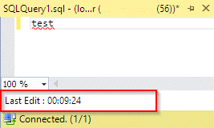

# SSMSX

<!-- Replace this badge with your own-->

<!-- Update the VS Gallery link after you upload the VSIX-->
Download this extension from the [CI build](http://vsixgallery.com/extension/SSMSX.1123e54f-64e7-4ee4-bc5b-bdfec68c52ec/)

---------------------------------------

SSMS 2016 Editor Extension project for adding quick fixes to SSMS using MEF extensions.

See the [changelog](CHANGELOG.md) for changes and roadmap.

## Features

- Show last time a query window was edited.

### Last Edited
Adds an editor margin to any SQL document which displays the last time the code was edited.

## Contribute
Check out the [contribution guidelines](CONTRIBUTING.md)
if you want to contribute to this project.

For cloning and building this project yourself, make sure
to install the
[Extensibility Tools 2015](https://visualstudiogallery.msdn.microsoft.com/ab39a092-1343-46e2-b0f1-6a3f91155aa6)
extension for Visual Studio which enables some features
used by this project.

## License
[Apache 2.0](LICENSE)